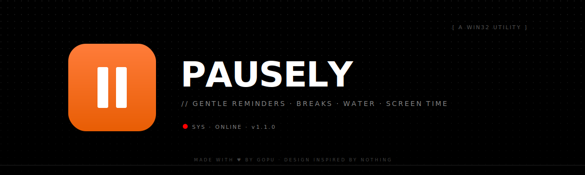
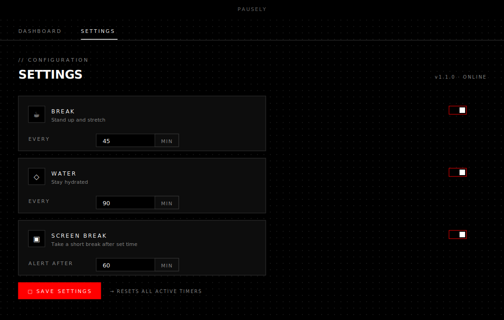
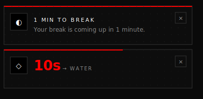
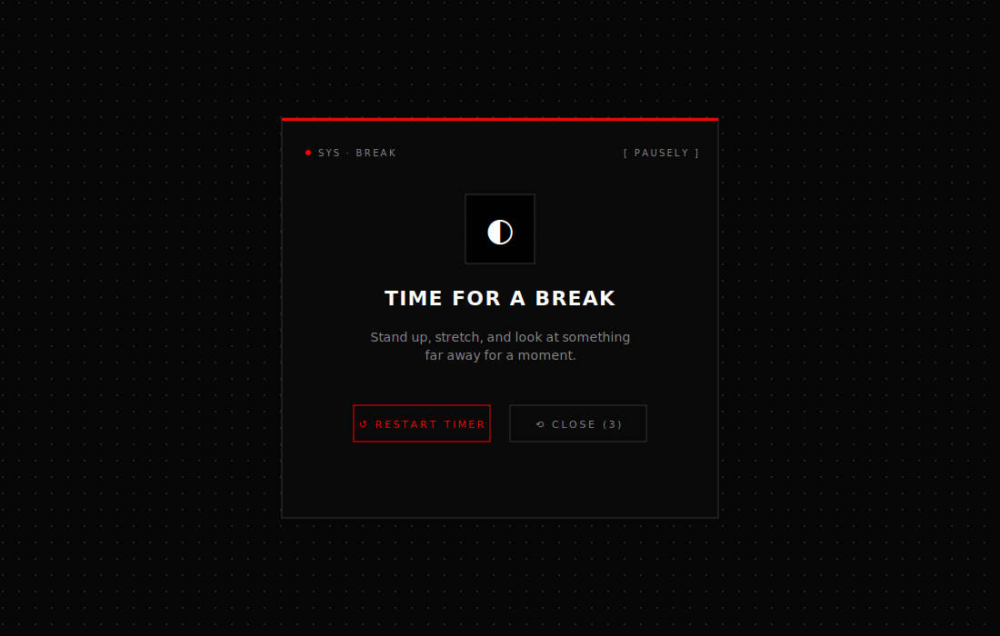

<div align="center">



<br/>

[](https://github.com/gopudas90/break-reminder/releases/latest)
[](https://github.com/gopudas90/break-reminder/releases)
[](#download)
[](LICENSE)

<br/>

### A gentle desktop reminder for breaks, water, and screen time.

<br/>

[**↓ Download for Windows**](https://github.com/gopudas90/break-reminder/releases/latest/download/Pausely-Setup-1.1.0.exe) &nbsp;·&nbsp; [Releases](https://github.com/gopudas90/break-reminder/releases) &nbsp;·&nbsp; [Privacy](PRIVACY.md)

</div>

<br/>

---

## What it does

Pausely runs quietly in your system tray and nudges you at the intervals you set:

- **Break** — stand up and stretch
- **Water** — stay hydrated
- **Screen Break** — give your eyes a rest

Each reminder fires a soft musical chime, a corner notification, and a full-screen modal so you actually notice it. Timers stop after each reminder and only restart when you ask them to — no autopilot.

<br/>

## Screenshots

<div align="center">


<sub><strong>Dashboard</strong> — three timers, dot-matrix clocks, status pills.</sub>

<br/><br/>



<sub><strong>Settings</strong> — toggle each reminder on/off and pick its interval.</sub>

<br/><br/>



<sub><strong>Corner popup</strong> — appears above the taskbar 1 minute and 15 seconds before each reminder.</sub>

<br/><br/>



<sub><strong>Full-screen reminder</strong> — locks the close button for 5 seconds so you actually pause. Restart the timer or close to dismiss.</sub>

</div>

<br/>

## Download

| Platform | Installer |
|----------|-----------|
| Windows 10 / 11 (x64) | **[Pausely-Setup-1.1.0.exe](https://github.com/gopudas90/break-reminder/releases/latest/download/Pausely-Setup-1.1.0.exe)** (~82 MB) |

Run the installer and Pausely will live in your system tray. macOS and Linux builds aren't shipped yet.

<br/>

## Features

- ◐ &nbsp; **Three independent timers** — break, water, and screen-break, each with its own on/off switch and interval
- ◑ &nbsp; **Layered warnings** — corner popup at 1 minute and a live countdown in the last 15 seconds, then a full-screen reminder
- ◒ &nbsp; **Considerate by design** — timers stop after each reminder so you decide when to restart, modal locks for 5 seconds so it isn't dismissed by reflex
- ◓ &nbsp; **Concurrent reminders** — if multiple timers fire at once, they queue and play sequentially without overlapping
- ◉ &nbsp; **System tray** — run quietly in the background, open from the tray, reset any timer from the tray menu
- ◈ &nbsp; **Fully offline** — no accounts, no telemetry, no network calls

<br/>

## Default intervals

| Reminder | Default |
|----------|---------|
| Break | every 45 minutes |
| Water | every 90 minutes |
| Screen Break | every 60 minutes |

All intervals are configurable from the **Settings** tab.

<br/>

## System requirements

- Windows 10 (1809+) or Windows 11, 64-bit
- ~250 MB disk space
- 2 GB RAM (4 GB recommended)
- No internet connection required

<br/>

## Build from source

```bash
git clone https://github.com/gopudas90/break-reminder.git
cd break-reminder
npm install
npm start          # run in dev mode
npm run dist:win   # build a Windows installer
```

Output lands in `release/Pausely Setup <version>.exe`.

<br/>

## Tech stack

- [Electron](https://www.electronjs.org/) 27 — desktop runtime
- [React](https://react.dev/) 18 + [Ant Design](https://ant.design/) 5 — UI
- [Webpack](https://webpack.js.org/) 5 — bundler
- [electron-builder](https://www.electron.build/) — packaging
- Vanilla HTML/CSS/JS for the notification popup and full-screen reminder
- Web Audio API for the chime

Design language inspired by [Nothing](https://nothing.tech/) — monochrome, dot-matrix, sharp corners, mono type.

<br/>

## Privacy

Pausely doesn't collect, transmit, or share any data. Settings live in `%APPDATA%\pausely\settings.json` and never leave your device. Full policy in [PRIVACY.md](PRIVACY.md).

<br/>

## License

MIT — see [LICENSE](LICENSE).

<br/>

<div align="center">

<sub>made with <span style="color:#ff0000">♥</span> by <a href="https://gopu.work">Gopu</a></sub>

</div>
